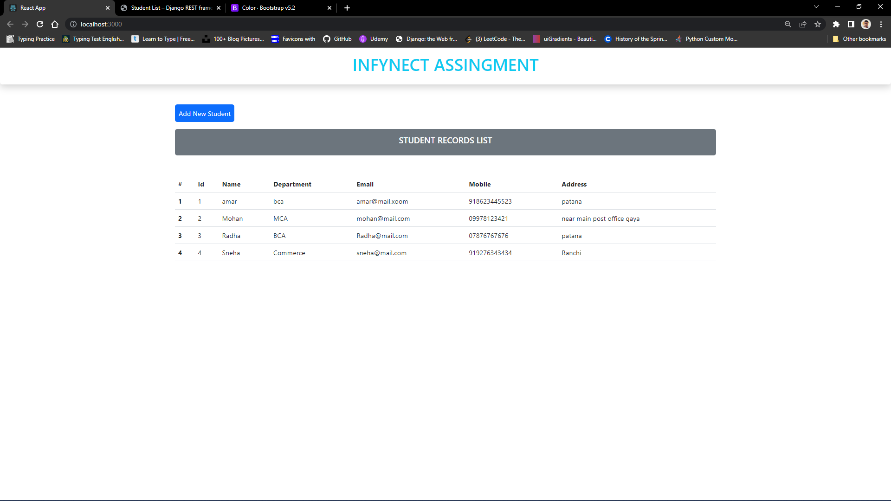
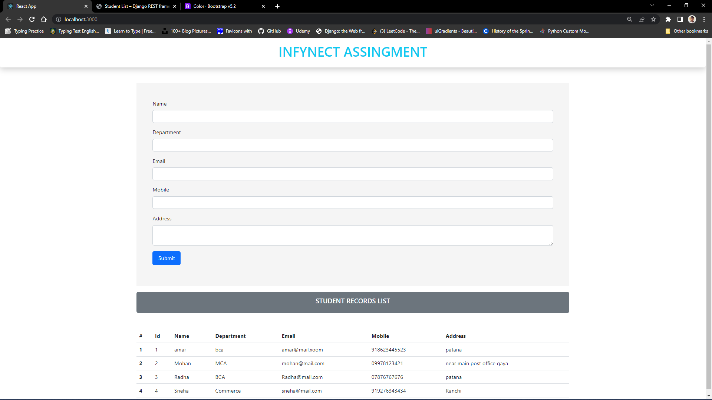

# Infynect Assingment
---
* In this project there are two folder
  1. Backend (Django)
  2. Frontend (React)

__Setup Django__
* first change directory to backend.
* Create virtualenv then install dependencies from requirement.txt.
* run some django command 
  * <code>python manage.py makemigrations</code>
  * <code>python manage.py migrate</code>
  * Create superuser<code>python manage.py createsuperuser</code>
  * Run the server <code>python manage.py runserver</code>

__Setup React__
* Change directory to frontend
*  run command <code>npm install</code>
*  to run react app <code>npm start</code>

__Screenshot__

